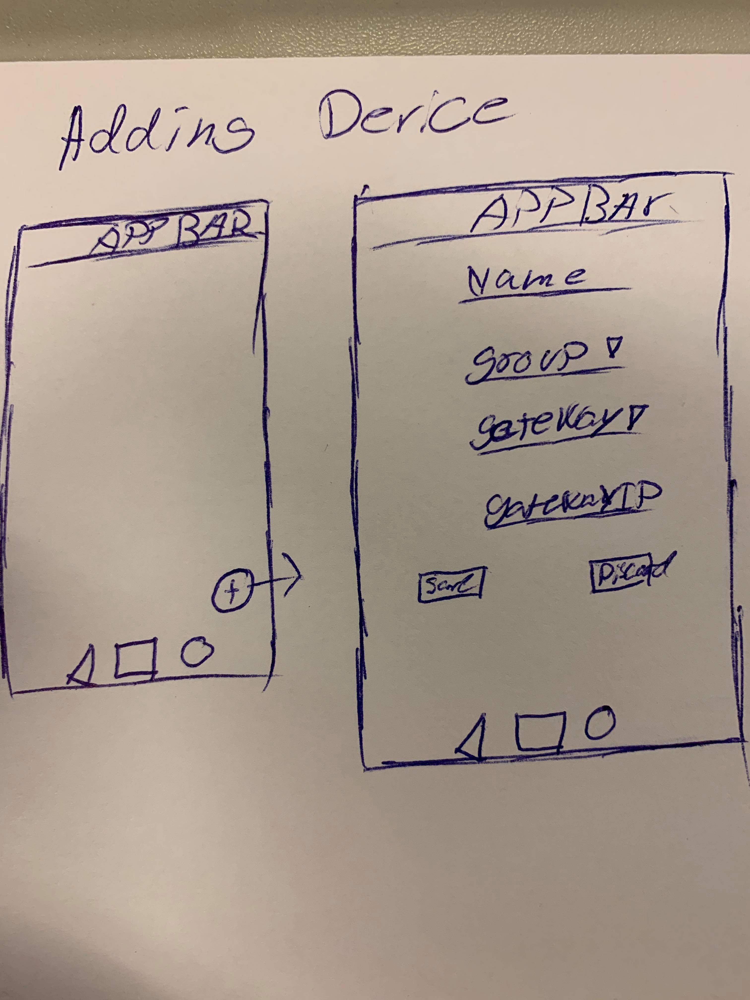
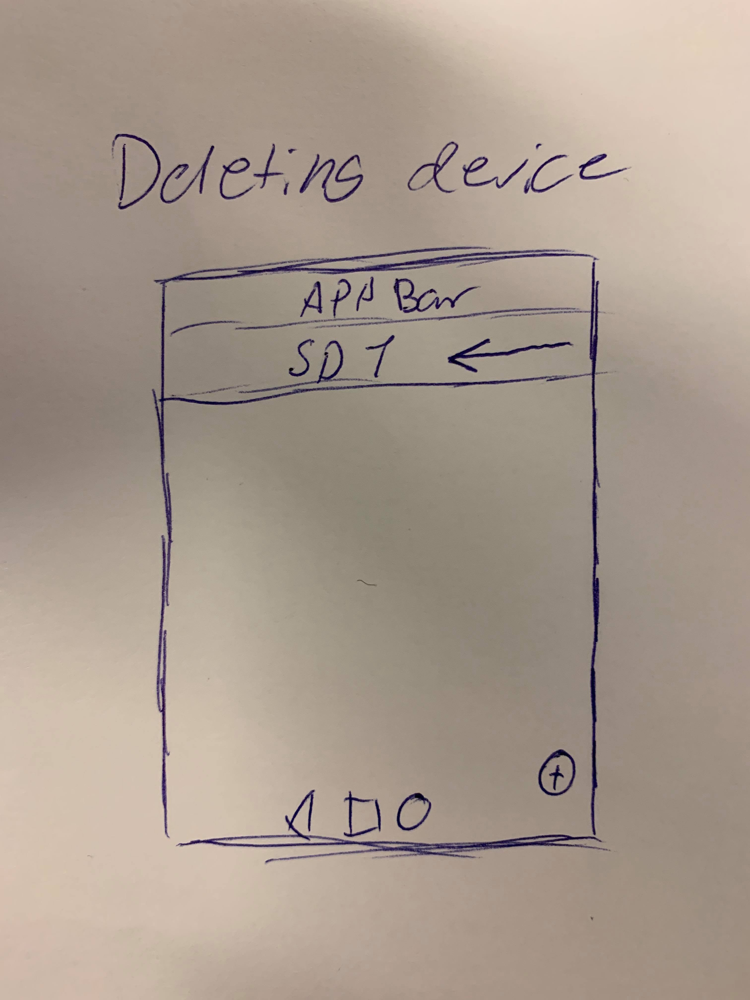
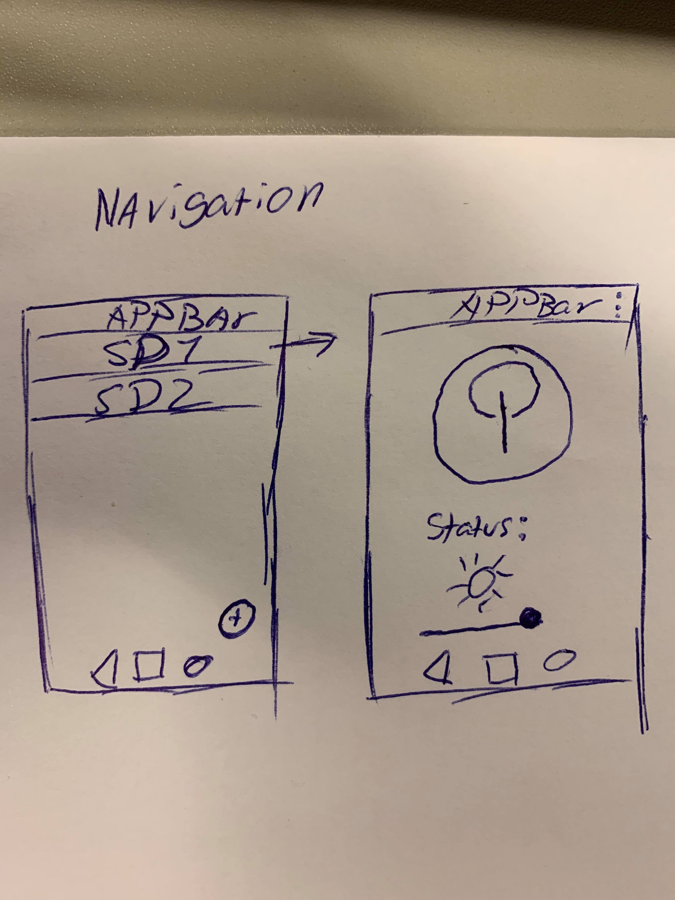
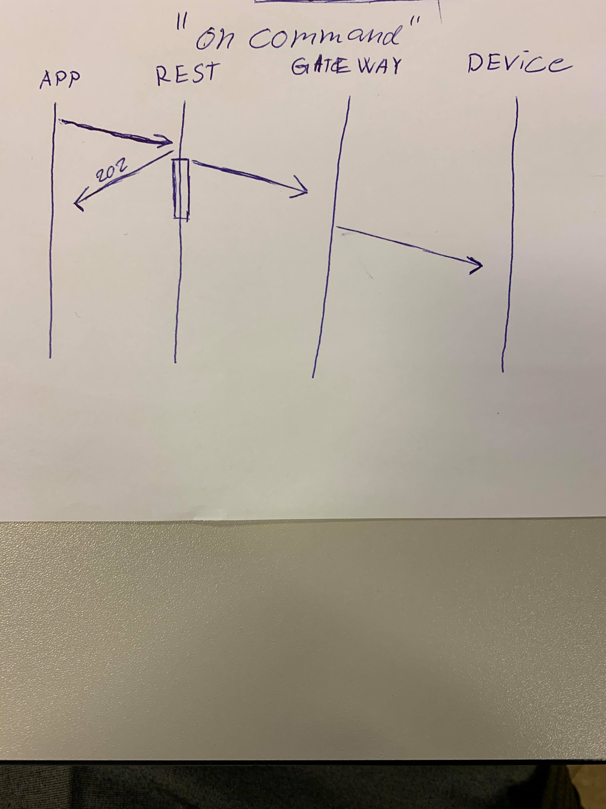

# **Product Report**
This report is suppose to reflect the usage & creation of my product.

## **Content**
1. [Introduction](#Introduction)
2. [Case & Thesis Statement](#Case-&-Thesis-Statement)
    1. [Case](#Case)
    2. [Tesis Statement](#Thesis-Statement)
3. [Product Description](#Product-Description)
    1. [Used Technologies](#Used-Technologies)
        1. [Software](#Software)
        2. [Hardware](#Hardware)
4. [Product workflow](#Product-Workflow)
    1. [Screens](#Screens)
    2. [Interactions](#Interactions)
        1. [REST Interface](#REST-Interface)
        2. [Database](#Database)
5. [Conclusion](#Conclusion)

## **Introduction**

The sole purpose of this report is to give the reader an overview & understanding of the product created. The product's usage and functionality should be reflected by this report.

## **Case & Thesis Statement**

This read should give you an overview of what problem(s) I am trying to solve.  
The case is a specific scenario, where the problem occurs.  
Thesis Statement is the specific problem.

### **Case**

You've just purchased a brand new smart home device, which you're going to install into your home, the product is nice, you're very excited about it, but then comes the setup process.  
This process is long and entangled in multiple steps.  
You wish there were an easier way to install it into your current system at home.

### **Thesis Statement**

How are we going to make the smart home integration more seemless?

We have multiple ways of solving this:  
* Add NFC to all Smart Devices so that when you hold the device close to your phone(e.g) it'll automatically integrate itself into the system.
* Grab a zigbee connecter, to connect the phone to the bulbs and then use / connect the device to the gateway.
* Create a layer between the smart device gateway and some sort of UI, that can handle multiple gateways & devices. (This is the way that I have chosen)

## **Product Description**
My way of solving the problem is by making a layer between the gateway and some UI.

I've created an app where you are able to save devices connected to a specific gateway.  
When the device is saved in the app it's sending a request to my REST interface with the required information  
to save it in a JSON file contained on the server side.  

The REST interface is handling all the request send to and from the gateway.  
This interface should be able to handle different manifactures gateways, but as I only  
have one gateway to test this on, it's the one that I am using.

### **Used Technologies**
Here is a quick overview of the technologies that I've chosen to use.

#### Software
* Python 3.7 (REST Interface)
    * Flask (webserver)
    * pytraadfri (A package for handling request to the IKEA gateway)
* JSON (Database file)
* Flutter (UI)
* Git (Version control)

#### Hardware
* IKEA Traadfri set (3 bulbs and 1 gateway)

## **Product Workflow**
This should give you a well defined overview of the workflow and the system as a whole.

### **Screens**
When starting the app, for the first time, you'll be met with an empty screen, since you have not added any devices yet. Pressing the button in the lowest right corner gets you into the "Adding a device" menu. Filling out this form and pressing save will send a request to the REST interface that'll then save the device.  
  
If you've already added some devices and e.g a bulb is broken, you can delete this entry by pulling to the left on the specific item. When doing this, it'll send a request to the REST interface to delete the entry in the DB.  
  
After adding the device, you can interact with it. To do so, you press the specific entry and you'll be navigated to the interaction page. Here you'll be able to turn if on / off, and regulate the intensity of the light. For more information about the interaction works, see [Interactions](#Interactions)  
  
  
### **Interactions**
Below figure will illustrate how the interaction works, when sending an "on" command to the bulb.
This is a "Fire and forget" situation, as the REST interface send a "202 - ACCEPTED" back, when getting the request in. As we have a status on the screen for the bulb, we ask for the state multiple times, after the request has been accepted by the REST API.
  

#### **REST Interface**
The REST interface is build up of 2 main methods, Devices() and Requests().  

Devices() is used for handling everything with the devices, Creating & Deleting. The funtionality of this is very basic, it simply has the connection to the DB file, and sees if the current device is stored, depending on the request it either deletes or add the device.  

Requests is used for handling every request send from the app to the specific device. In addition to these two methods I've created a new library for connecting to the gateway and sending the request, as this needs to be async, using a eventloop.  

Async methods library (self made)  
This library handles the async request to the gateway to be able to use the connected smart devices, from the app. The REST interface interacts with this library to make the connections work. This should create an abstraction from the REST interface, as this is a seperate library, that can be used by everyone else. This library contains a class with the methods needed for the gateway interaction. When instatiating the class it'll need an eventloop from the calling interface.  

##### **Database**
The REST interface is the single handler of the database.  

On the "Server side", which would be the REST API, there is a file names "db.json" which contains all the information in the database. The database is made up with pure JSON, so that we can pull it out of the file and use the information. The database is not meant to be a big file, a few devices and some a few entries for groups.

## **Conclusion**
Based on the fact, that I only could develop with one manifacturers product, this is a very basic implementation, but could be developt further for the project.

The project works as intended, and is easy to use and deploy.

I believe that this could be done in a production setting, and be used videly.